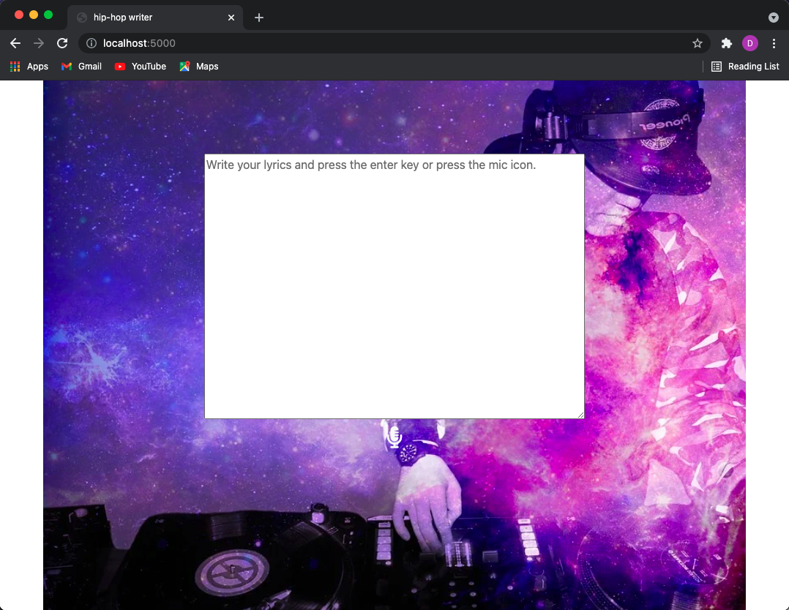
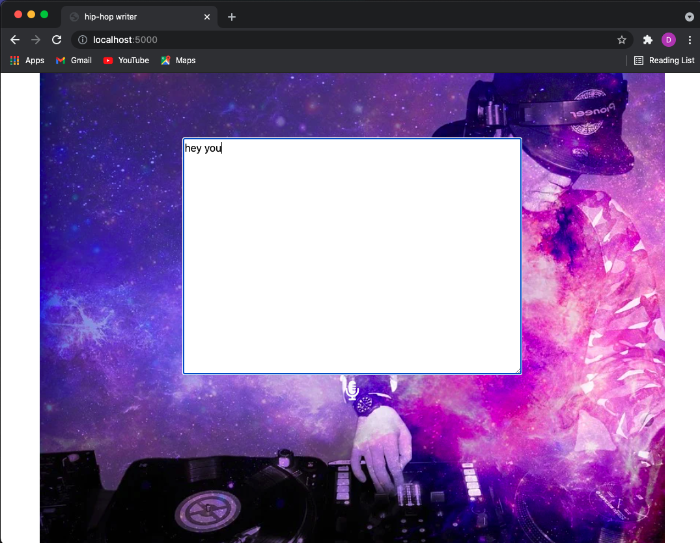

# HIP-HOP verse generator

---

[](https://ainize.web.app/redirect?git_repo=https://github.com/EastHShin/HIPHOP-verse-gen)

---



Writing a HIP-HOP verse makes Rapper cry out in anguish.
HIP-HOP verse generator, however, helps you write verse easily
by pressing the Enter key or Mic button!
If you want to get verses continuously, press the key one more time.
Then, new verses are created from previously created verse.
<br>
<br>


<br>

<br>
- Verses are created with a length of 30.
## Dataset
HIP-HOP verse generator's dataset consists of various
rapper's verse data (e.g, ASAP Rocky, Eminem, Drake, Kanye West... etc.).
Therefore, you can receive verses in various styles!

## How to make
1. Find the verse dataset in the Kaggle.
   [Dataset Link](https://www.kaggle.com/rikdifos/rap-lyrics?select=ASAP+Rocky_lyrics.txt)
   
2. Pre-process the dataset. If you have CSV file, you should convert the file into txt file because Teachable NLP
   works only when using txt file.
3. Use the [Teachable NLP](https://ainize.ai/teachable-nlp) to fine-tune the GPT-2 with hip-hop verse dataset.
4. Write a Dockerfile and Upload it to GitHub.
5. Deployment the service by [Ainize](https://ainize.ai/).


## Health Check API
```
$ curl --request GET 'https://train-28fsu5ldr900ckrct8t1-gpt2-train-teachable-ainize.endpoint.ainize.ai/ping'
{
  "status": "Healthy"
}
```
